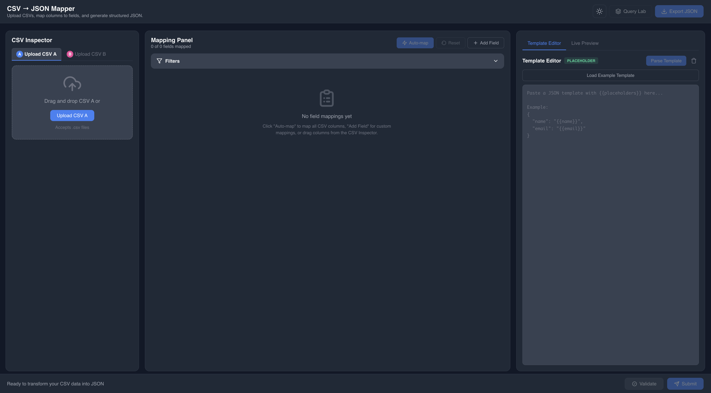
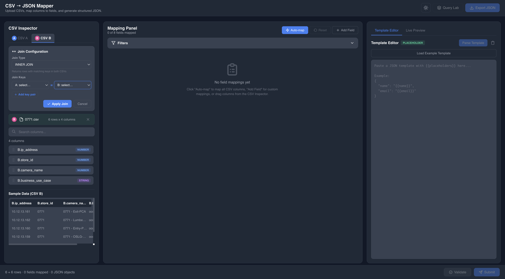
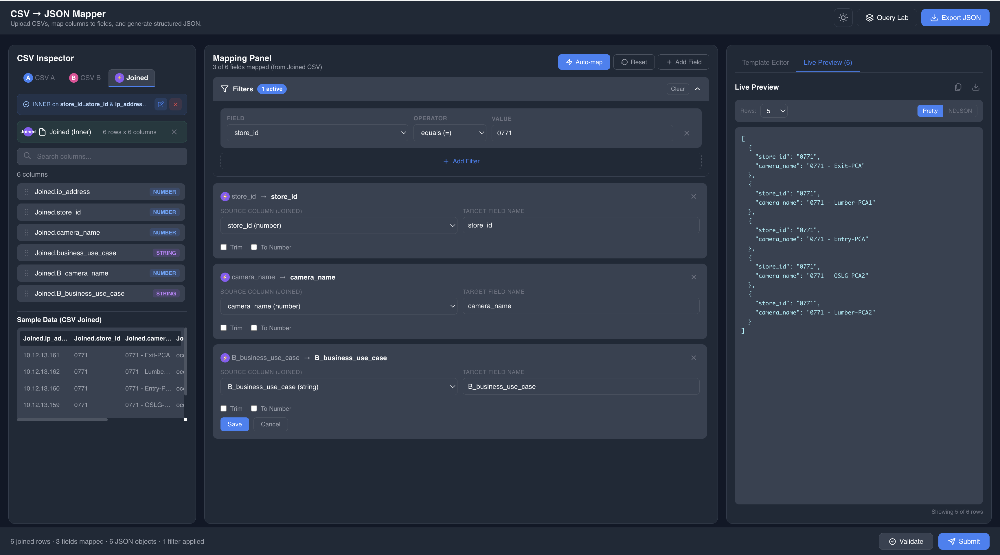
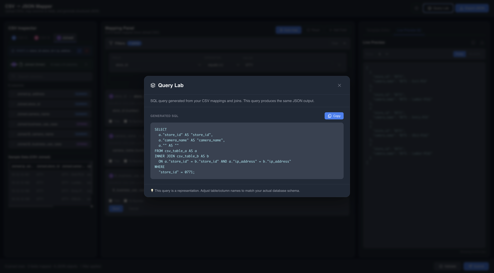

# CSV → JSON Mapper

A powerful visual tool to transform CSV data into structured JSON with drag-and-drop field mapping, SQL-like joins, row filtering, and automatic SQL query generation.


<!-- TODO: Add main screenshot here -->






---

## 🎯 **What Is This?**

CSV → JSON Mapper is a browser-based tool that lets you:
- Upload one or multiple CSV files
- Visually map columns to JSON field names with drag-and-drop
- Join datasets with SQL-like logic (INNER, LEFT, RIGHT, FULL OUTER)
- Filter rows with WHERE clause conditions
- Generate structured JSON output instantly
- Export SQL queries that replicate your transformation

**No coding required.** Perfect for data analysts, developers, and anyone working with CSV data.

---

## ✨ **Key Features**

### 📂 **CSV Upload & Inspection**
- Upload single or multiple CSV files
- Auto-detect column types (string, number, boolean, date)
- Preview data with sample rows
- Drag-and-drop column mapping

### 🔗 **SQL-Like Joins**
- Join two CSV files with visual configuration
- Support for INNER, LEFT, RIGHT, and FULL OUTER joins
- Multi-key (composite) join support
- Automatic column conflict resolution with prefixing

### 🎯 **Field Mapping**
- Visual drag-and-drop interface
- Auto-map all columns with one click
- Custom field renaming
- Data transformations (trim, convert to number)
- Template-based mapping with `{{placeholder}}` syntax

### 🔍 **Row Filtering (WHERE Clause)**
- Filter rows with visual condition builder
- 9 operators: `=`, `!=`, `>`, `<`, `>=`, `<=`, `LIKE`, `IN`, `NOT IN`
- AND/OR logic between conditions
- Real-time preview of filtered results

### 💻 **SQL Query Generation**
- Automatic SQL query generation from your mappings
- Includes SELECT, FROM, JOIN, and WHERE clauses
- Copy-paste ready for your database
- Supports all transformation and filter logic

### 🎨 **User Experience**
- Clean, modern dark/light theme
- Live JSON preview as you work
- Validation with helpful error messages
- Export JSON to file
- Responsive design

---

## 🚀 **Quick Start**

### **Prerequisites**
- Node.js 14.0 or higher
- npm or yarn

### **Installation**

```bash
# Clone the repository
git clone https://github.com/man7asvi/csv-json-mapper.git

# Navigate to project directory
cd csv-json-mapper

# Install dependencies
npm install

# Start development server
npm start
```

The app will open at `http://localhost:3000`

---

## 📖 **How to Use**

### **Step 1: Upload Your CSV Files**
1. Click on the **CSV Inspector** panel (left side)
2. Upload CSV A and/or CSV B
3. Preview your data and column types

<!-- TODO: Add screenshot -->
<!--  -->

### **Step 2: Configure Join (Optional)**
If you have two CSVs:
1. Click **"Join CSV A & CSV B"** button
2. Select join type (INNER, LEFT, RIGHT, FULL OUTER)
3. Choose join keys from both CSVs
4. Add multiple key pairs for composite joins
5. Click **"Apply Join"**

<!-- TODO: Add screenshot -->
<!--  -->

### **Step 3: Map Your Fields**
1. In the **Mapping Panel** (middle), click **"Auto-map"** for quick setup
2. Or manually drag columns from CSV Inspector to create mappings
3. Rename target field names as needed
4. Apply transformations (Trim, To Number)

<!-- TODO: Add screenshot -->
<!--  -->

### **Step 4: Add Filters (Optional)**
1. Expand the **Filters** section in the Mapping Panel
2. Click **"Add Filter"**
3. Select field, operator, and value
4. Toggle AND/OR logic between conditions
5. See live preview update automatically

<!-- TODO: Add screenshot -->
<!--  -->

### **Step 5: Preview & Export**
1. Click **"Submit"** in the footer
2. View your JSON in the **Live Preview** panel (right side)
3. Toggle between Pretty and NDJSON formats
4. Click **"Export JSON"** to download

<!-- TODO: Add screenshot -->
<!--  -->

### **Bonus: Generate SQL Query**
1. Click **"Query Lab"** in the header
2. View the auto-generated SQL query
3. Copy and use in your database

<!-- TODO: Add screenshot -->
<!--  -->

---

## 🛠️ **Built With**

### **Frontend**
- **React 18** - UI framework
- **Styled Components** - Component styling
- **React Dropzone** - File upload handling

### **Core Logic**
- Custom CSV parser with type detection
- In-memory JOIN engine supporting all SQL join types
- Template engine with placeholder support
- SQL query generator

### **Development**
- Create React App
- ESLint for code quality
- Git for version control

---

## 📁 **Project Structure**

```
csv-json-mapper/
├── src/
│   ├── components/
│   │   ├── common/
│   │   │   └── Header/              # App header with theme toggle
│   │   ├── CSVInspector/            # CSV upload and preview
│   │   ├── MappingPanel/            # Field mapping + filters
│   │   ├── TemplateEditor/          # Template editing & live preview
│   │   └── QueryLab/                # SQL query modal
│   ├── utils/
│   │   ├── csvParser.js             # CSV parsing & type detection
│   │   ├── mappingUtils.js          # Mapping, filtering, JOIN logic
│   │   └── sqlGenerator.js          # SQL query generation
│   ├── App.js                       # Main application
│   ├── App.styles.js                # Global styled components
│   └── App.css                      # Theme variables & global styles
├── public/
├── package.json
└── README.md
```

---

## 🎨 **Features in Detail**

### **Field Mapping**
- **Auto-map**: Instantly maps all CSV columns to matching JSON field names
- **Drag-and-drop**: Drag columns from CSV Inspector directly onto mapping cards
- **Custom naming**: Rename target fields to match your desired JSON structure
- **Transformations**: 
  - **Trim**: Remove whitespace from strings
  - **To Number**: Convert string values to numeric types

### **Join Configuration**
- **Join Types**:
  - **INNER JOIN**: Returns only matching rows from both CSVs
  - **LEFT JOIN**: All rows from CSV A, matching rows from CSV B
  - **RIGHT JOIN**: All rows from CSV B, matching rows from CSV A
  - **FULL OUTER JOIN**: All rows from both CSVs
- **Multi-key Support**: Join on multiple columns for complex relationships
- **Automatic Column Naming**: Handles column name conflicts with B_ prefix

### **Filter System**
- **Operators**:
  - **Equality**: `=`, `!=`
  - **Comparison**: `>`, `<`, `>=`, `<=`
  - **Text Search**: `LIKE` (case-insensitive contains)
  - **List Matching**: `IN`, `NOT IN` (comma-separated values)
- **Logic Operators**: Chain conditions with AND/OR
- **Real-time**: JSON preview updates instantly as you add filters

### **SQL Query Generation**
The generated SQL includes:
- SELECT with column mappings and transformations
- FROM clause with table aliases
- JOIN conditions (for multi-CSV workflows)
- WHERE clause with all your filters
- Proper SQL syntax for copy-paste into databases

---

## 💡 **Use Cases**

### **Data Migration**
Convert legacy CSV exports into JSON for modern APIs:
```
Customer CSV → JSON → REST API
```

### **ETL Pipelines**
Prototype data transformations before writing SQL:
```
Raw CSV → Visual Mapping → SQL Query → Production Pipeline
```

### **Data Integration**
Join customer data from multiple sources:
```
CRM Export (CSV A) + Sales Data (CSV B) → Unified JSON
```

### **Reporting**
Filter and transform data for analytics:
```
Raw Data → Filter by date range → Map to dashboard format → Export
```

### **API Development**
Generate mock data structures:
```
CSV Template → JSON Schema → API Response Format
```

---

## 🤝 **Contributing**

Contributions are welcome! Here's how you can help:

1. **Fork the repository**
2. **Create a feature branch**: `git checkout -b feature/amazing-feature`
3. **Commit your changes**: `git commit -m 'Add amazing feature'`
4. **Push to the branch**: `git push origin feature/amazing-feature`
5. **Open a Pull Request**

### **Development Guidelines**
- Follow existing code style
- Add comments for complex logic
- Test your changes thoroughly
- Update documentation if needed

---

## 🐛 **Known Issues & Limitations**

- Maximum file size: ~10MB per CSV (browser memory limitation)
- Large datasets (>10k rows) may cause performance slowdown
- Date parsing relies on standard formats (YYYY-MM-DD, MM/DD/YYYY)
- Template engine does not support nested JSON structures

---

## 🗺️ **Roadmap**

- [ ] Support for Excel files (.xlsx, .xls)
- [ ] Advanced date/time transformations
- [ ] Custom JavaScript transformations
- [ ] Saved mapping templates
- [ ] Batch processing for multiple files
- [ ] Export to other formats (XML, YAML)
- [ ] Cloud storage integration (Google Drive, Dropbox)
- [ ] Collaborative mapping (shareable links)

---

## 📄 **License**

This project is licensed under the MIT License - see the [LICENSE](LICENSE) file for details.

---

## 👨‍💻 **Author**

**Manasvi Choumal**
- GitHub: [@man7asvi](https://github.com/man7asvi)

---

## 🙏 **Acknowledgments**

- Inspired by SQL database management tools
- Built with Create React App
- Icons from Lucide/Feather icon sets
- Color palette based on Tailwind CSS

---

## 📞 **Support**

If you found this project helpful, please consider:
- ⭐ **Starring the repository**
- 🐛 **Reporting bugs** via Issues
- 💡 **Suggesting features** via Issues
- 🔗 **Sharing** with others who might find it useful

---

**Made with ❤️ for data professionals everywhere**